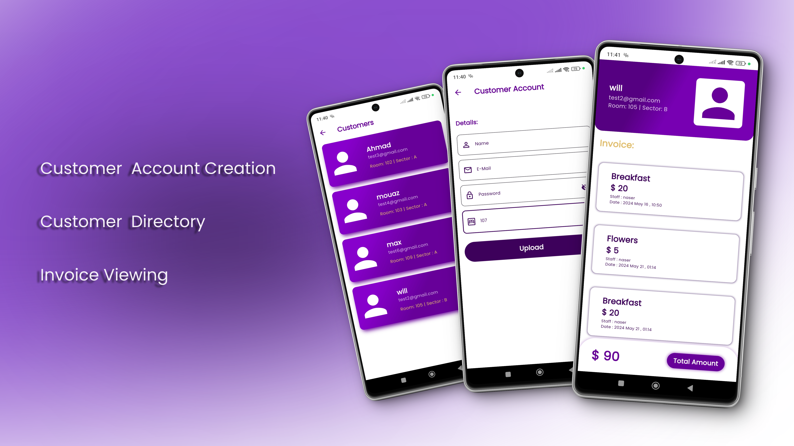
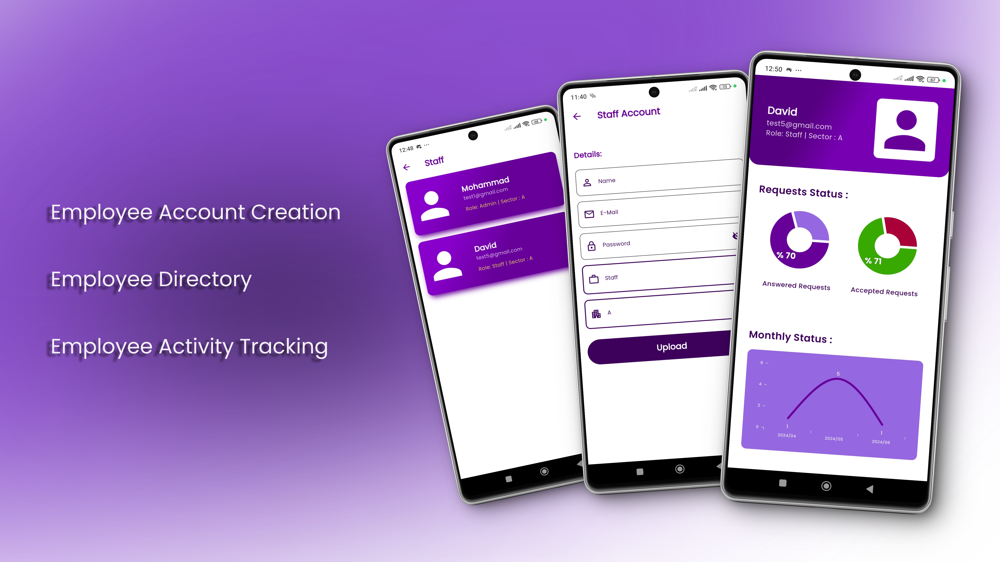
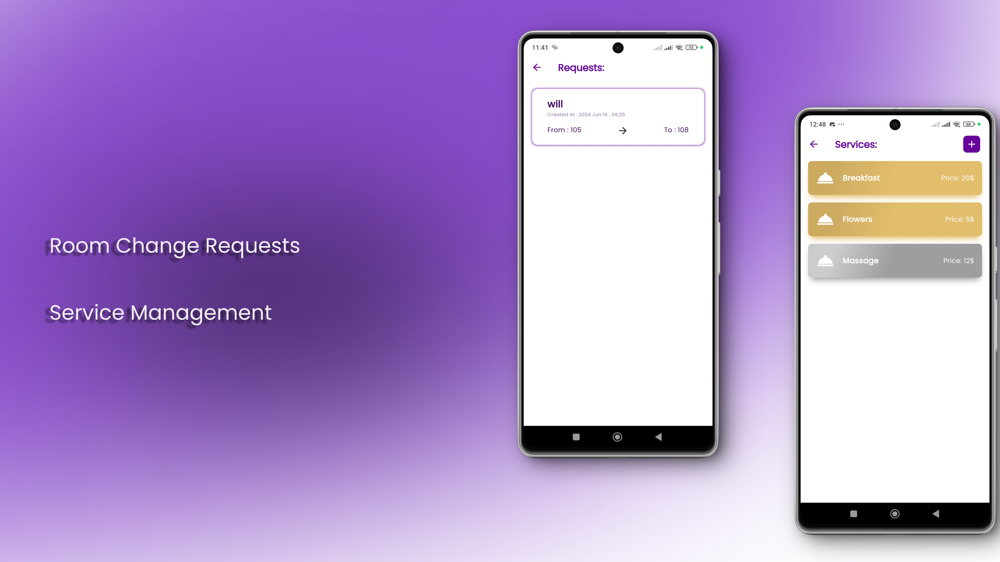

  
  <h1>Royal Orhcid Hotel</h1>

Hotel management system for streamline and automate various operations within a hotel or hospitality establishment. It provides a centralized platform for managing different aspects of hotel operations, including guest management, room reservations, billing and invoicing, staff management, and inventory control.
  

# :star2: About 

 
  

## :star2: Admin Part

 
  

### :dart: Features
- Customer  Account Creation: The Admin can easily add customer accounts with their personal information, simplifying the process of organizing customer data.
- Customer Directory: The Admin has access to a comprehensive list of all customers, making it convenient to browse and locate specific individuals.
- Invoice Viewing: The Admin can view and access customer invoices, allowing for efficient tracking of customer transactions and payments.

 
  

### :dart: Features
- Employee  Account Creation:  Simplify the process of adding employee accounts by allowing Admins to easily input their personal information.
- Employee Directory: Access a comprehensive list of all employees, enabling managers to quickly search and locate specific individuals.
- Employee Directory: Access a comprehensive list of all employees, enabling managers to quickly search and locate specific individuals.

 
  

### :dart: Features
- Service Management: The Admin has the ability to add and modify hotel services, allowing for easy customization and adaptation to meet customer needs.
- Room Change Requests: The app enables the Admin to promptly respond to customer requests for room changes, ensuring a seamless and efficient experience for guests.
