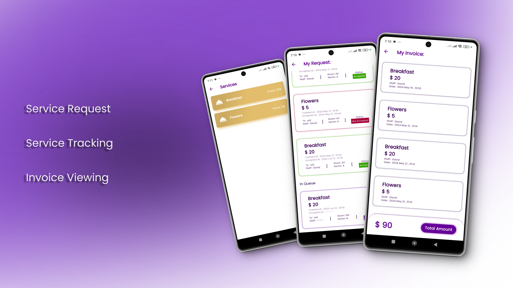
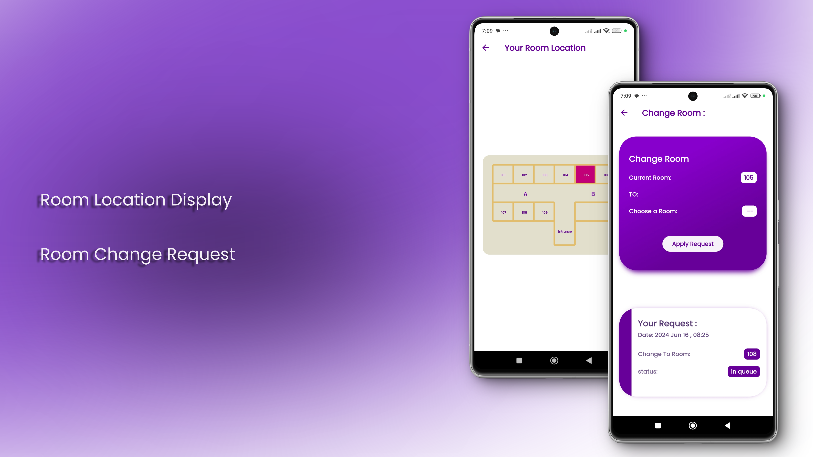

  
  <h1>Royal Orhcid Hotel</h1>

Hotel management system for streamline and automate various operations within a hotel or hospitality establishment. It provides a centralized platform for managing different aspects of hotel operations, including guest management, room reservations, billing and invoicing, staff management, and inventory control.
  

# :star2: About 

 
  

## :star2: Admin Part

 
  

### :dart: Features
- Customer  Account Creation: The Admin can easily add customer accounts with their personal information, simplifying the process of organizing customer data.
- Customer Directory: The Admin has access to a comprehensive list of all customers, making it convenient to browse and locate specific individuals.
- Invoice Viewing: The Admin can view and access customer invoices, allowing for efficient tracking of customer transactions and payments.

 
  

### :dart: Features
- Employee  Account Creation:  Simplify the process of adding employee accounts by allowing Admins to easily input their personal information.
- Employee Directory: Access a comprehensive list of all employees, enabling Admins to quickly search and locate specific individuals.
- Employee Activity Tracking: Gain valuable insights into employee productivity and progress by allowing Admins to monitor and track their activity and performance.

 
  

### :dart: Features
- Service Management: The Admin has the ability to add and modify hotel services, allowing for easy customization and adaptation to meet customer needs.
- Room Change Requests: The app enables the Admin to promptly respond to customer requests for room changes, ensuring a seamless and efficient experience for guests.

## :star2: Customer Part

 
  

### :dart: Features
- Service Request: Customers can easily request services from the hotel, ensuring a seamless and convenient experience for their needs and preferences.
- Service Tracking:  Customers will have the ability to track the status of their service requests. This feature allows customers to easily monitor the progress of their service requests, ensuring transparency and providing peace of mind.
- Invoice Viewing: Customers will also have access to their invoices for the services provided to them. This feature allows customers to view invoices, providing them with a clear breakdown of the services rendered and associated costs.

 
  

### :dart: Features
- Room Location Display: Customers can view the location of their hotel room on a hotel floor plan, providing them with a visual representation of their room's position within the hotel.
- Room Change Request: Customers have the ability to request a room change, allowing them to easily switch to a different room based on their preferences or needs.

